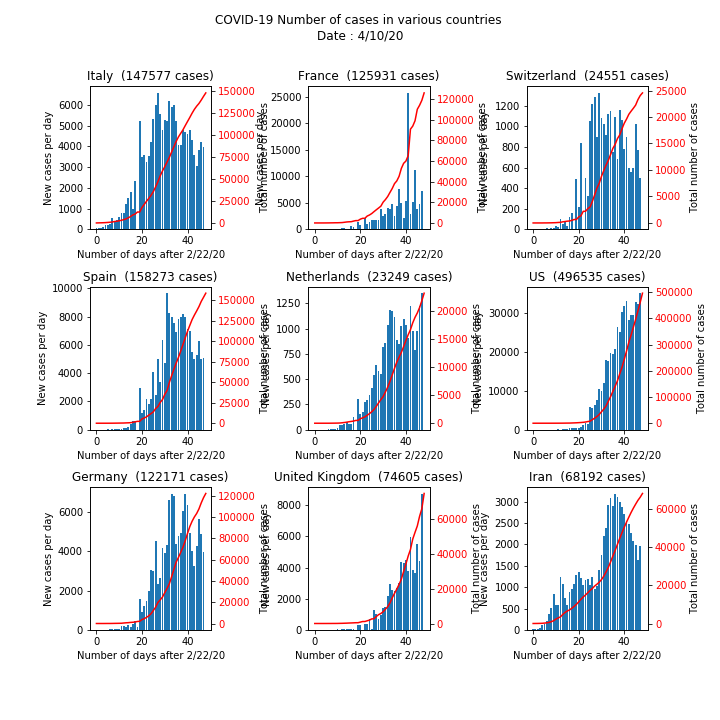
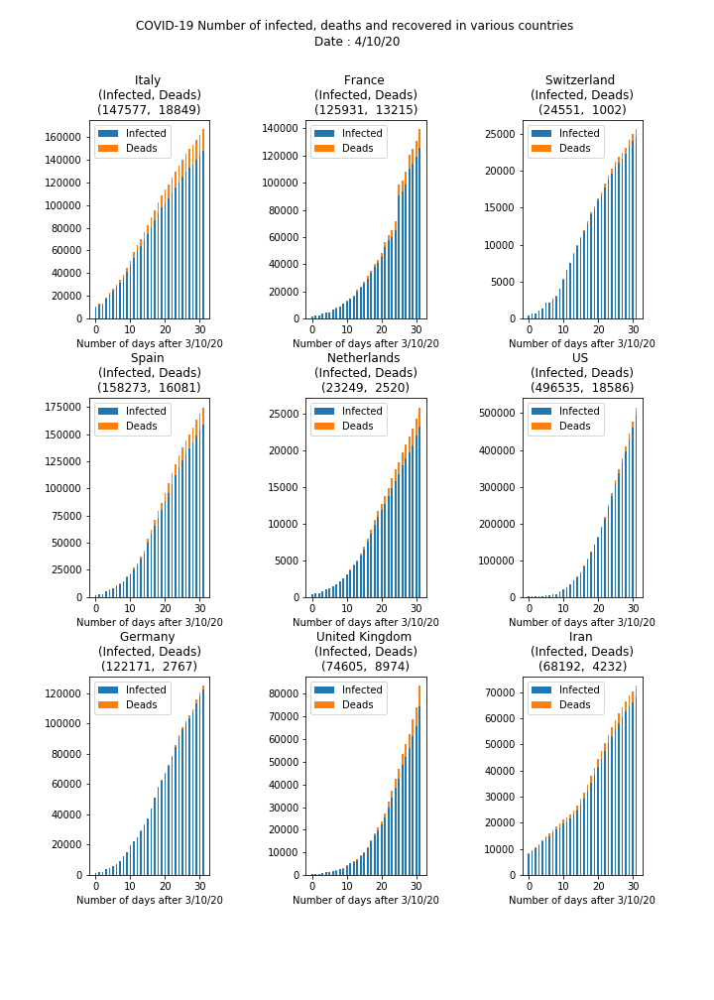
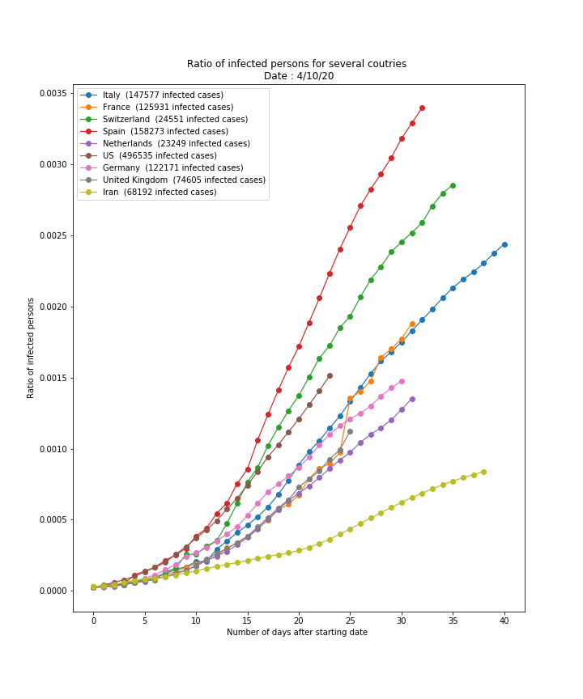

# COVID19-Analysis

This repo offers a template to analyze the virus situation in Europe.

We do not attribute any value to what is computed, it is only a visualization tool that we developed. 

## Presentation of the generated graphs

We used the given database to generate some graphs, as a visualisation tool. 

### Normalized comparison between different European countries

In this plot, we want to compare the evolution in different european countries. European countries usually have comparable order of sizes, which make them more comparable. Also, the confinment methods used accross europe are fairly the same (and are very different than with China). 

### Number of cases in some European countries

This plot is simply informative and shows the number of infected persons in various countries.

### Number of infected, deaths and recovered, in some European countries

This plot tries to underly the dynamic evolution of the epidemic. 

### Relative comparison of the evolution of the virus in different countries

We are not very sure of the relevance of this plot, but we believe it can be interesting to look at it as well. It compares the **relative evolution** of the virus in different countries, starting at the date where the ratio of infected of the overall countries is 2e-5 over the overall population. 

## How to make it run...

This section explains how to run the code yourself

To make it work, one need to have access to the WHO database, accessible here: https://github.com/CSSEGISandData/COVID-19. 

The folder hierarchy needs to be the following

- yourFolderName 
  - CovidAnalysis: git clone of this repository
  - COVID19: git clone of the database (https://github.com/CSSEGISandData/COVID-19)

With this set-up, the Python code will run properly. 

Note that every time one wants to update the database, you need to 'git pull' the database folder (go to the folder in the terminal, type 'git pull').
