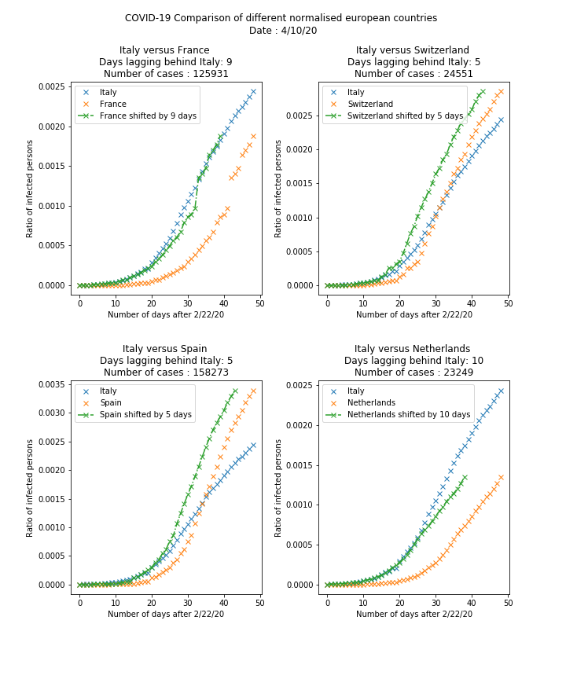

# COVID19-Analysis

This repo offers a template to analyze the virus situation in Europe.

We do not attribute any value to what is computed, it is only a visualization tool that we developed. 

## Presentation of the generated graphs

### Normalized comparison between different European countries

### Number of cases in some European countries

### Number of infected, deaths and recovered, in some European countries

## How to make it run...

This section explains how to run the code yourself

To make it work, one need to have access to the WHO database, accessible here: https://github.com/CSSEGISandData/COVID-19. 

The folder hierarchy needs to be the following

- yourFolderName 
  - CovidAnalysis: git clone of this repository
  - COVID19: git clone of the database (https://github.com/CSSEGISandData/COVID-19)

With this set-up, the Python code will run properly. 

Note that every time one wants to update the database, you need to 'git pull' the database folder (go to the folder in the terminal, type 'git pull').
